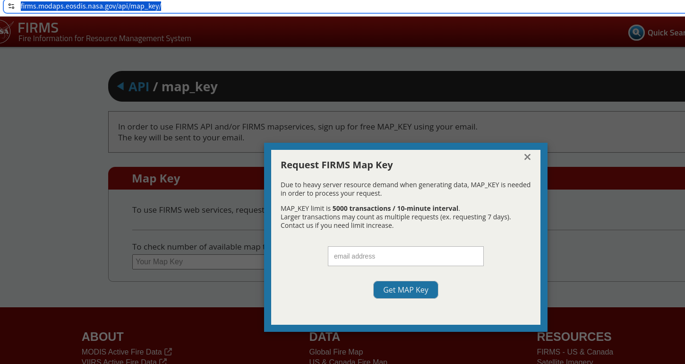

# 💡 firms-java

## ❓ firms-java是什么?
firms-java是用于请求美国Nasa资源管理火灾信息系统的卫星数据Java客户端,用于方便的构建请求美国Nasa资源管理火灾信息系统的卫星数据，他可以应用在Java项目和Spring/SpringBoot项目中。

## ❓ 什么是Firms

火灾信息资源管理系统（FIRMS）分发来自Aqua和Terra卫星上的中分辨率成像光谱仪（MODIS）以及S-NPP、NOAA 20和NOAA 21（正式名称为JPSS-1和JPSS-2）上的可见光红外成像辐射计套件（VIIRS）的近实时（NRT）活跃火灾数据。

官网:[https://firms.modaps.eosdis.nasa.gov](https://firms.modaps.eosdis.nasa.gov/)


## 📦 结构

1. satellite-core : 核心包,基础的SatelliteClient客户端和方法。
2. satellite-spring: 添加了spring依赖的自动配置,提供spring、SpringBoot支持.
3. satellite-application: SpringBoot集成服务演示。

## 🔑 密钥获取

要获取Firms卫星数据，需要在官网获取MapKey。可以通过下面的两种方法获取

第一种方法：可以通过官网[密钥获取](https://firms.modaps.eosdis.nasa.gov/api/map_key/),在下述对话框内输入邮件，即可获取密钥。


第二种方法：如果你是通过springBoot集成spring包启动Web项目，可以在引入依赖并启动后，
通过http://127.0.0.1:[实际运行端口]/satellite.html ，并输入邮件后点击发送邮件，也可以获取MapKey.


## ⚙️ Spring配置文件

```yaml
nasa:
  #获取的密钥
  map-key: 35ece758e7525ad595b401b65fa1c83b
  #经纬度范围
  area: 116.2,34.5,122,38
```

## ⭐ 示例

```java
package com.nodcat.satellite;

import io.github.nodcat.enums.Satellite;
import org.springframework.beans.factory.annotation.Autowired;
import org.springframework.stereotype.Service;

import java.util.List;

/**
 * @author nodcat
 * @version 1.0
 * @since 2026/2/24 上午8:19
 */
@Service
public class CustomSatelliteServiceImpl implements CustomSatelliteService {
    
    
    //当使用了配置文件时，可以使用自动注入
    @Autowired
    SatelliteClient satelliteClient;

    //或者

    //自定义进行客户端初始化
//    static final SatelliteClient satelliteClient = new SatelliteClientImpl(
//            new SatelliteClientProperties(
//                    "35ece758e7525ad595b401b65fa1c83b", //mapKey
//                    "116.2,34.5,122,38" //Area range
//            ));
    @Override
    public List<SatelliteScanData> getSatelliteData() {
        //获取日期2026-01-22，时间范围为5天的VIIRS_SNPP_NRT型号卫星数据
        return satelliteClient.getSatelliteScanData(
                Satellite.VIIRS_SNPP_NRT, 
                "5", 
                "2026-01-22");
    }
}

```
# ⬇️ 安装

## Maven

### Core
```
<dependency>
    <groupId>io.github.nodcat</groupId>
    <artifactId>satellite-core</artifactId>
    <version>1.0</version>
</dependency>
```
### Spring
```
<dependency>
    <groupId>io.github.nodcat</groupId>
    <artifactId>satellite-spring</artifactId>
    <version>1.0</version>
</dependency>
```

## 🤝 贡献与反馈

如果你有任何建议或发现了 Bug，欢迎提交 Issue 或 Pull Request！
如果你觉得这个项目对你有帮助，请给一个 ⭐ Star！


